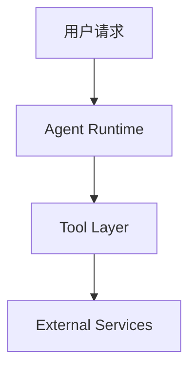
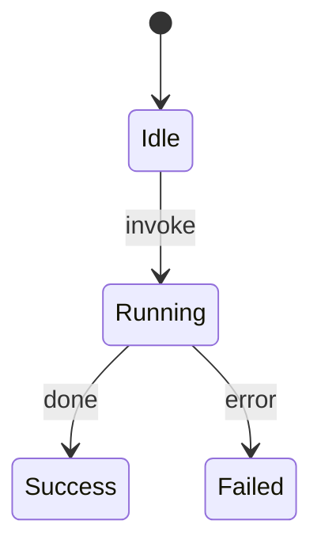

# Blog Writer — AI 架构技术博客

## When to Use

- 写 AI / Agent 框架分析文章
- 写偏架构判断的技术博客
- 写工具、协议、工作流的深度拆解
- 写需要结合代码、表格、Mermaid、Prompt 与设计分析的技术文章

## Writing Workflow

1. **先读资料，再决定写法**
    - 阅读源码、官方文档、发布说明、示例项目或相关文章。
    - 先提炼文章真正要回答的 1 个核心问题，再开始写。
2. **先判断文章模式**
    - 在起草前先判断更接近“架构解读型 / 工具上手型 / 方案实践型 / 对比分析型”。
3. **提炼主论点**
    - 用一句话说明文章的核心判断，例如“X 真正的价值在于 Y，而不是 Z”。
4. **决定需要哪些材料**
    - 流程或结构不易解释时用 Mermaid。
    - 对比、演进、选型优先用表格。
    - 代码、Prompt、接口定义只在能支撑论点时出现。
5. **生成大纲再写正文**
    - 默认按“为什么写 -> 问题是什么 -> 核心机制 -> 实践/示例 -> 取舍/边界 -> 总结”展开。
6. **做一次成稿自检**
    - 检查是否真的解释了 why，是否保留了资料来源，是否为了形式强加图表或场景块。

## Article Modes

### 1. 架构解读型

**适用场景：**

- 解读 AI / Agent 框架、协议、运行时、上下文机制

**推荐结构：**

1. 为什么要关注这个主题
2. 它到底解决什么问题
3. 核心架构或关键机制
4. 设计取舍与替代方案
5. 总结与适用边界

**优先材料：**

- Mermaid 架构图
- 机制说明图
- 对比表格

### 2. 工具介绍与上手型

**适用场景：**

- 介绍 AI 工具、插件、协议集成方式或新工作流

**推荐结构：**

1. 这类工具为什么值得写
2. 工具是什么，解决什么问题
3. 如何快速上手
4. 实际使用体验与限制
5. 总结与建议

**优先材料：**

- 命令示例
- 配置片段
- 操作步骤

### 3. 方案实践与实现型

**适用场景：**

- 讲怎么把某个 AI 能力、架构模式或工具真正落地到项目里

**推荐结构：**

1. 项目背景与目标
2. 方案设计
3. 核心实现
4. 优化点、坑点与边界
5. 总结

**优先材料：**

- 代码片段
- Prompt 片段
- Mermaid 流程图

### 4. 对比分析与选型型

**适用场景：**

- 对多个框架、协议、方案或实现路径做取舍分析

**推荐结构：**

1. 对比问题是什么
2. 评价维度
3. 逐项对比
4. 适用场景与选型建议
5. 总结

**优先材料：**

- 对比表格
- 关键差异清单

## Transition Note

上半部分用于决定这篇文章该怎么写：先判断写作目标、文章模式和材料组织方式。

下半部分用于指导具体怎么写：包括正文风格、图表与表格使用、可复用段落模板，以及成稿前的自检要求。

## Core Style Rules

1. **先讲为什么写，再讲它是什么**
   - 开篇先交代背景、动机、问题或观察。
   - 不要一上来堆定义。
2. **解释 why，不只罗列 what**
   - 每个重点段落尽量回答：解决什么问题、为什么这样设计、代价是什么。
3. **章节标题要回答真实问题**
   - 优先使用解释型、问题型标题，例如“X 到底是什么？”、“Y 的原理和优化方法”。
4. **代码和 Prompt 是论证材料**
   - 只贴能支撑结论的关键片段。
   - 贴完必须解释，不要贴完就结束。
5. **保持专业、解释性强、带判断的语气**
   - 可以有个人判断，但不要营销化或夸张化。
6. **结尾必须有综合判断**
   - 总结里至少补一层：适用边界、推荐场景、取舍或未来方向。

## Diagram and Table Policy

### 优先使用 Mermaid 的情况

| 场景 | 推荐图类型 |
|------|------------|
| 系统全景或模块关系 | `graph TB` |
| 执行流程或调用链 | `graph LR` / `graph TD` |
| 状态变化 | `stateDiagram-v2` |
| 类或接口关系 | `classDiagram` |

### 优先使用表格的情况

- 框架对比
- 方案取舍
- 技术演进
- 能力矩阵
- 选型建议

### 不要强制加图

- 如果文字已经足够清楚，不要为了形式添加 Mermaid。
- 如果内容是简单对比，优先使用表格而不是画图。
- 不要求文章顶部必须出现架构图。

### Mermaid 常用示例





## Optional AI Architect Lens

当文章偏架构分析时，可以补充以下视角，但不是每节强制要求：

1. 设计哲学：为什么这样设计
2. 核心收益：获得了什么
3. 代价与边界：牺牲了什么
4. 扩展性：是否支持后续演进
5. 替代方案：为什么没有采用其他实现

## Reusable Section Templates

### 开篇模板

````markdown
## 为什么写这篇文章

[行业讨论 / 项目背景 / 实际问题]

这篇文章想回答的问题是：[一句话写清核心问题]
````

### 核心机制模板

````markdown
## 核心机制

[先说明机制是什么]

[再解释为什么这样设计]

[最后补充它解决了什么问题]
````

### 实践示例模板

````markdown
## 实践示例

下面用一个最小示例说明它在真实项目中如何使用：

```ts
// 关键代码片段
```

这段代码真正体现的是：[一句话解释它说明了什么]
````

### 对比分析模板

````markdown
## 对比与取舍

| 维度 | 方案 A | 方案 B |
|------|--------|--------|
| 适用场景 | [方案 A 典型场景] | [方案 B 典型场景] |
| 优势 | [方案 A 的核心优势] | [方案 B 的核心优势] |
| 代价 | [方案 A 的主要代价] | [方案 B 的主要代价] |
````

### 可选场景模板

````markdown
**场景：[具体场景]**

**问题：** [该场景下真正的问题]

**解决方式：** [系统或方案如何处理]

**效果：** [最终带来的收益或代价]
````

### 总结模板

````markdown
## 总结

- 核心判断：[用一句话提炼文章结论]
- 适用边界：[说明适合什么场景，不适合什么场景]
- 进一步实践建议：[给出下一步建议]
````

## Reference Requirements

如果文章基于外部资料、文档、源码、博客或研究内容，必须在文末保留原始链接，统一放在 `## 参考资料` 小节。

```markdown
## 参考资料

- [Source Name](https://example.com/source-url)
- [Another Source](https://example.com/another-url)
```

不要为了让文章“更干净”而移除来源链接。

## Self-Review Checklist

- [ ] 开篇是否说明了这篇文章为什么值得写
- [ ] 是否围绕一个清晰的核心问题展开
- [ ] 是否解释了设计原因与取舍，而不是只描述功能
- [ ] 示例是否真的支撑了论点，并且有解释
- [ ] 图表和表格是否是按需使用，而不是为了形式硬加
- [ ] 结尾是否有综合判断、边界或建议
- [ ] 是否保留了所有关键资料链接
- [ ] 是否避免了“终极指南”“颠覆式”“革命性”这类营销化措辞
