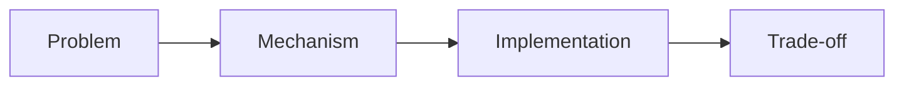

# Article Template — AI 架构技术博客

> 用于快速搭建符合 `blog-writer` 新 workflow 的文章草稿

---

## 标题与元信息

````markdown
---
title: [文章标题]
date: YYYY-MM-DD
tags: [tag-a, tag-b]
summary: [一句话摘要]
---

> 正文不要再额外写 H1，frontmatter 的 `title` 就是主标题。
> 发布稿只保留读者可见内容，不保留 `- core_thesis:`、`## Illustration Decision`、brief、checklist 等过程块。
````

---

## 开篇模板

````markdown
## 为什么写这篇文章 / 文章动机

[用一两段话说明写这篇文章的背景、动机和核心问题。可以是行业讨论、项目背景，或者一个实际问题。]

[行业讨论 / 项目背景 / 实际问题]

本文真正想回答的问题是：[一句话写清核心问题]
````

---

## 正文模块（按需组合）

### 问题或概念说明

````markdown
## 它到底是什么

[先解释概念，再说明它解决什么问题]
````

### 核心机制

````markdown
## 核心机制

[讲清关键流程、结构或设计思路]
````

### 实践或示例

````markdown
## 实践示例

```ts
// 关键片段
```

[解释这段示例真正说明了什么]
````

### 对比与取舍

````markdown
## 对比与取舍

| 维度 | 方案 A | 方案 B |
|------|--------|--------|
| 适用场景 | [方案 A 典型场景] | [方案 B 典型场景] |
| 优势 | [方案 A 的核心优势] | [方案 B 的核心优势] |
| 代价 | [方案 A 的主要代价] | [方案 B 的主要代价] |
````

---

## 图表选择

- 流程、状态、结构关系：优先使用 Mermaid
- 对比、演进、选型：优先使用表格
- 如果文字已足够清楚，可以不放图

Mermaid 示例：



---

## 结尾模板

````markdown
## 总结

- 核心判断：[用一句话提炼文章结论]
- 适用边界：[说明适合什么场景，不适合什么场景]
- 后续建议：[给出下一步建议]
````

---

## Checklist

- [ ] 开篇先交代动机或问题
- [ ] 章节标题回答真实问题
- [ ] 示例有解释
- [ ] 图表按需使用
- [ ] 结尾包含判断或边界
- [ ] 保留资料来源链接
- [ ] 发布稿不保留 `- core_thesis:`、`## Illustration Decision` 等工作过程块
